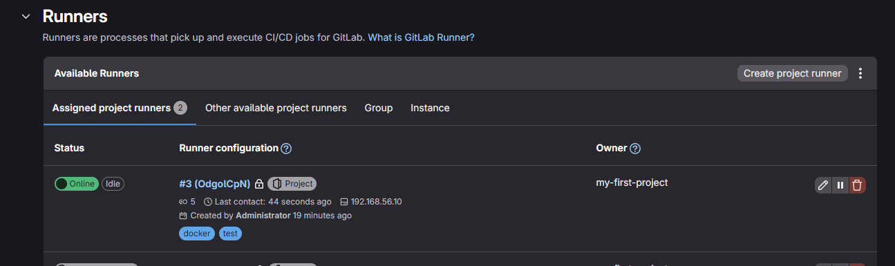
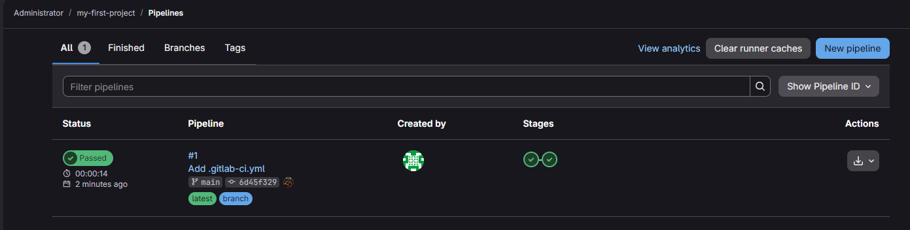
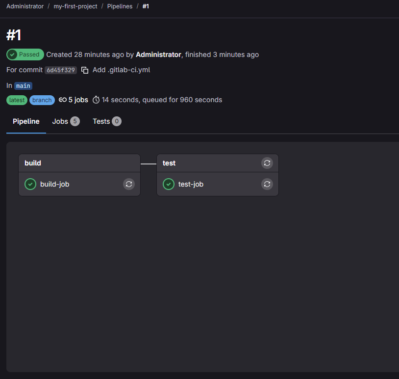
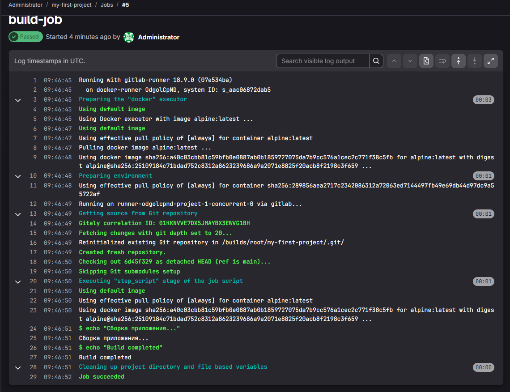

# Домашнее задание к занятию "GitLab CI/CD" - Шилихин Денис

## Инструкция по выполнению домашнего задания

1. Сделайте fork данного репозитория к себе в Github и переименуйте его по названию или номеру занятия, например, https://github.com/ваш-логин/gitlab-ci-hw
2. Выполните клонирование данного репозитория к себе на ПК с помощью команды `git clone`.
3. Выполните домашнее задание и заполните у себя локально этот файл README.md:
   - впишите вверху название занятия и вашу фамилию и имя
   - в каждом задании добавьте решение в требуемом виде (текст/код/скриншоты/ссылка)
   - для корректного добавления скриншотов воспользуйтесь инструкцией "Как вставить скриншот в шаблон с решением"
   - при оформлении используйте возможности языка разметки md

## Задание 1: Развертывание GitLab и регистрация раннера

**Решение:**

1. GitLab развернут локально с помощью Vagrant
2. Создан проект `my-first-project`
3. Зарегистрирован gitlab-runner в режиме Docker

**Скриншот настроек раннера:**



## Задание 2: Настройка CI/CD

**Решение:**

Создан файл `.gitlab-ci.yml`:

```yaml
stages:
  - build
  - test

build-job:
  stage: build
  tags:
    - docker
    - test
  script:
    - echo "Сборка приложения..."
    - echo "Build completed"

test-job:
  stage: test
  tags:
    - docker
    - test
  script:
    - echo "Тестирование..."
    - echo "Tests passed"
```







---
